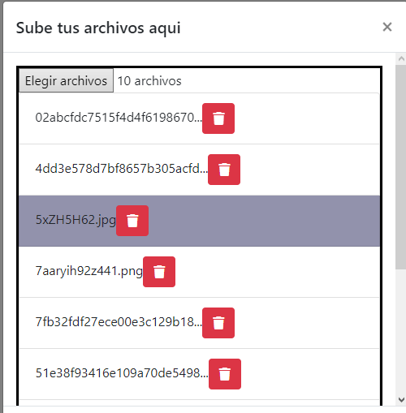

# Input File Multiple Dinamico en JavaScript y HTML

## Tutorial Utilizado
- [JAVASCRIPT INPUT FILE MULTIPLE SIN REPETICIONES CON PREVIA](https://programadorwebvalencia.com/javascript-input-file-multiple-sin-repeticiones-y-previa/)

En el tutorial se muestra un input file que es capaz de identificar archivos repetidos, puede dar una lista previa de los nombres de los archivos seleccionados, es posible el reordenarlos, ademas de que se pueden eliminar archivos de la seleccion.

